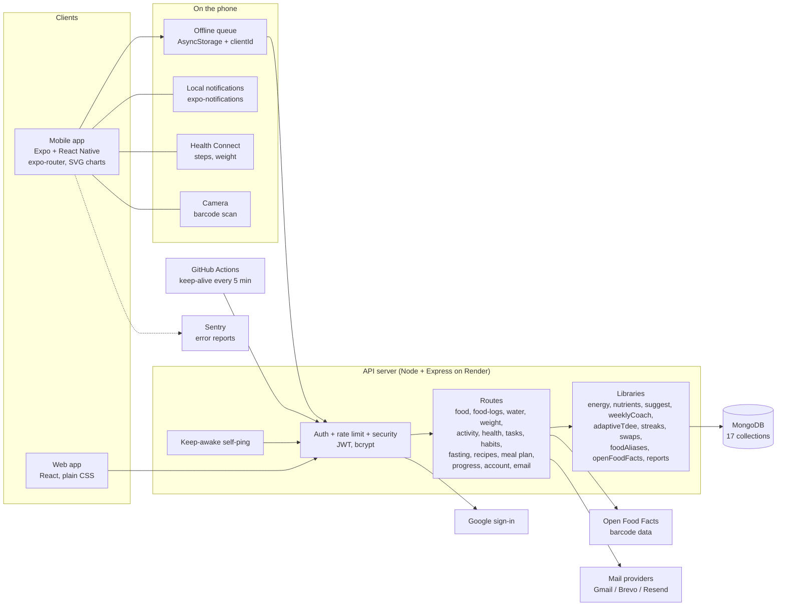

# FlexFit: architecture, features and design

FlexFit is a fitness and nutrition tracker with an anime-sticker personality. It has a **mobile app** (Expo / React Native, Android first), a **web app** (React) and one shared **API** (Node / Express / MongoDB). Both apps talk to the same server and use the same energy rules.

## 1. System architecture

### How a request flows
1. The app calls the API with a JWT. Writes from the mobile app go through the **offline queue**: each write carries a `clientId`, so retrying after a bad connection never creates duplicates (`lib/idempotent.js`).
2. Express middleware: security headers, CORS, rate limits, JSON parsing, then `requireAuth`.
3. A route validates input (`lib/validate.js`), uses the libraries for the maths, and reads or writes MongoDB through Mongoose models.
4. The response goes back; the app updates its cache and screens.

### Hosting and operations
| Part | Where | Notes |
|---|---|---|
| API | Render web service (free tier) | `render.yaml`, health check `/api/health` |
| Keep-awake | server self-ping every 4 min + GitHub Action every 5 min | free instances sleep after ~15 min idle |
| Database | MongoDB (Atlas) | catalogue seeded additively on boot via one bulk call |
| Email | Gmail API, Brevo, Resend or SMTP (tried in that order) | Render's free tier blocks SMTP ports, so HTTPS providers go first |
| Errors | Sentry (mobile) | optional |

## 2. Data model (MongoDB collections)
| Collection | Holds |
|---|---|
| User, Profile | account, body stats, goals, preferences, notification settings |
| Food | catalogue (762 shared foods) plus each person's own foods, favourites |
| FoodLog | what was eaten, per meal and day, with nutrition snapshot |
| SavedMeal, Recipe, MealPlan | reusable meals, recipes with portions left (meal prep), weekly plan |
| WaterLog, WeightLog | hydration and weigh-ins (with optional notes) |
| Activity, ActivityLog, WorkoutTemplate | exercise catalogue, sessions, templates |
| HealthLog | daily steps and health data |
| Habit, HabitLog, Task | habits with streaks, tasks with reminders and repeats |
| Fast | intermittent fasting windows |

## 3. The calculation engine
One energy model lives in three copies that are checked against shared test fixtures: `server/lib/energy.js`, `client/src/utils/energy.js`, `mobile src/utils/energy.ts`.

| Quantity | Method |
|---|---|
| Resting energy (BMR) | Mifflin-St Jeor |
| Maintenance (TDEE) | BMR x activity factor 1.2 / 1.375 / 1.55 / 1.725 / 1.9 |
| Calorie target | maintenance minus (pace x 7,700 / 7); floor 1,500 (men) / 1,200 (others); never above maintenance when losing |
| Activity credit | only activity beyond what the activity factor already assumes earns extra food |
| Steps | 0.0005 kcal per step per kg |
| Water | about 35 ml per kg, between 1.5 and 5 L |
| Macro goal | protein 1.6 g/kg (2.0 gaining), capped at 35% of calories; fat 27%; carbs the rest; fibre 14 g per 1,000 kcal |
| Macro range | protein 1.2-2.0 g/kg (within 10-35% of calories); fat 20-35%; carbs at least 130 g and 35% up to 65%; fibre goal up to 50 g |
| Limits | sodium 2,000 mg, sugar 10% of calories |
| Real maintenance estimate | average logged intake minus weight trend x 7,700 (needs about 3 weeks of data) |

## 4. Features

**Track**
- Food log by meal; search 762 foods (home-cooked Indian, restaurant, chains, packaged); search understands Hindi, Telugu, Tamil and Malayalam words
- "Type what you ate" parsing, barcode scan (Open Food Facts), eating-out estimates with sizes and a 15% safety buffer
- Usual portions remembered, same-as-yesterday, saved meals, recipes with meal-prep portions
- Water (quick add 250 ml / 500 ml / 1 L), weight with notes and trend chart, exercise, steps (Health Connect), fasting, habits, tasks

**Understand**
- Home dashboard: calorie ring, water, steps, exercise, streak flame
- Progress with Day / Week / Month / Year / Custom ranges (presets, weekly averages for long ranges)
- Weekly coach: review score, one or two specific tips, weekly calorie budget, real-maintenance estimate, swap suggestions, boss-fight challenge
- Macro ranges with minimum and maximum, plus fibre, sugar and sodium limits
- Dietitian PDF report and weekly summary email

**Keep going**
- Reminders: water, tasks, motivation, meals, custom; quiet hours, daily cap, skip when done, spaced so they never arrive in a burst
- Streaks with one freeze per week; achievements and a sticker collection
- Characters that react to what you do; a character per page

**Reliability**
- Offline queue, idempotent writes, retry on cold start, wake-up banner, keep-awake pings

## 5. Screens
**Mobile:** Home, Log, Progress, Tasks, Profile (History behind Progress); Food, Water, Weight, Exercise, Health & steps, Fasting, Habits, Recipes, Meal planner, Weekly, Achievements, Photos, Reminders, Onboarding, Login / Sign-up / Forgot password.
**Web:** Dashboard, Food logger, Food database, Water, Weight, Exercise, Health, Habits, Tasks, Recipes, Planner, Progress, Profile, Account, Onboarding, Auth.

## 6. Design system
- **Look:** soft lavender-to-pink gradient background with blurred blobs, white rounded cards (22 px radius), frosted panels behind content, dark mode with a plain background.
- **Colour roles:** one purple primary for the main action; calories orange, protein green, water blue, steps teal; red and green status always paired with an arrow or words.
- **Type:** system font, large bold headings, numbers in tabular figures; nothing below 12 px; muted text at 4.5:1 contrast or better.
- **Controls:** one style for inputs, selects, checkboxes; buttons at least 44 px tall; secondary buttons bordered with hover.
- **Spacing:** 4 / 8 / 12 / 16 / 24 / 32 scale.
- **Characters:** six anime characters (Jin-Woo, Naruto, Luffy, Zoro, Goku, Gojo) as sticker sprites with activity poses; hover or tap animation moves the whole body; one character pinned per page (Luffy food, Goku workouts, Zoro steps, Naruto water, Jin-Woo habits and achievements, Gojo weekly and progress).
- **Layout:** mobile: five bottom tabs; web: single column, two columns on Log Food at 1100 px and wider, sticky meal selector.

## 7. Known limits
- Calories and macros are estimates; home-cooked values vary with oil and portion size.
- Vitamins and minerals other than sodium, sugar and fibre are not tracked yet.
- The 7,700 kcal per kg rule overstates long-term loss; the real-maintenance card corrects for this.
- Health Connect (Android) only; no Apple Health yet.
